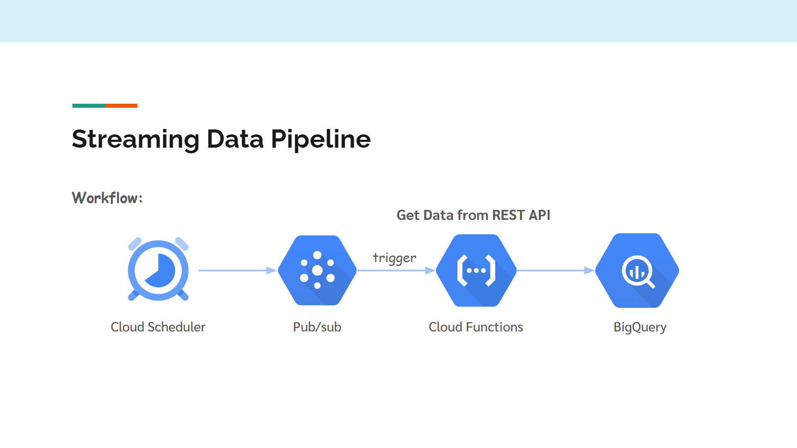
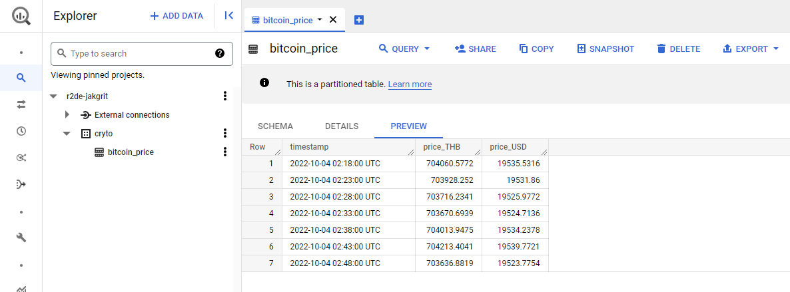

# Simple Streaming Data Pipeline on Google Cloud
The purpose of the project is to learn how to build a streaming Data pipeline on Google Cloud.

## What are we going to do
We're going to get the bitcoin price from Coindesk API and take it into BigQuery.

## Coindesk API
https://api.coindesk.com/v1/bpi/currentprice/THB.json

## Workflow

## How to do this
Note: To do this you need access to a project that links to Billing Account. (There is Free Trial if you're new to Google Cloud)

***(In BigQuery)***  
**Step 1:** Create dataset and table  
<u>Tip!</u> Your table schema needs to match the data sequence inserted into BigQuery.

***(In Cloud Functions)***  
**Step 2:** Create function that triggered by pub/sub  
**Step 3:** Assign Runtime environment variables  
<u>Ex:</u>
- table id = your_project.your_dataset.your_table  
- url = https://api.coindesk.com/v1/bpi/currentprice/THB.json  

**Step 4:** Add code from this repo to the editor   
**Step 5:** Deploy

***(In Cloud Scheduler)***  
**Step 6:** Create scheduler  
<u>Ex.</u> If you want to collect the data every 5 mins -> In the Frequency field, type */5 * * *

<u>Tip!</u> Every job has to be created in the same Region.

## After a while the result in BigQuery should look like this
